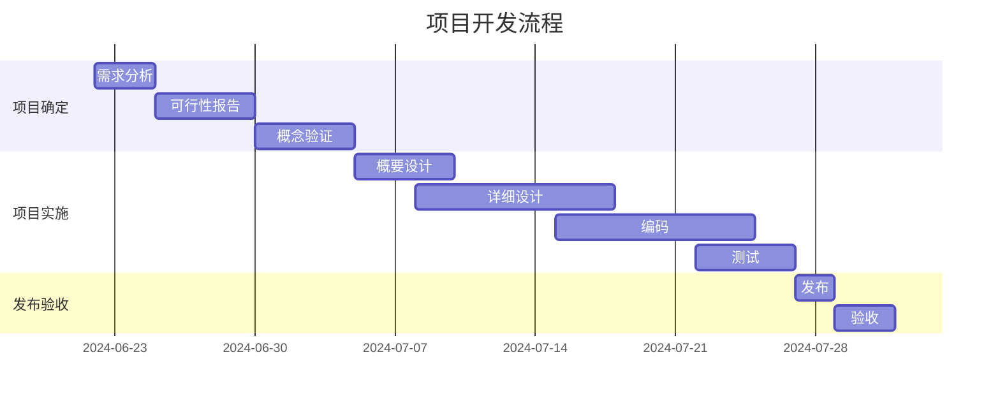
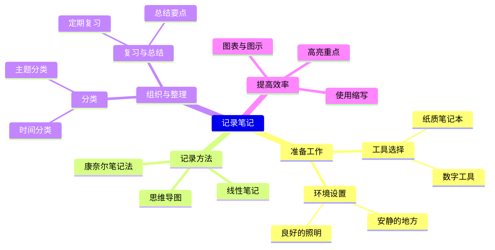
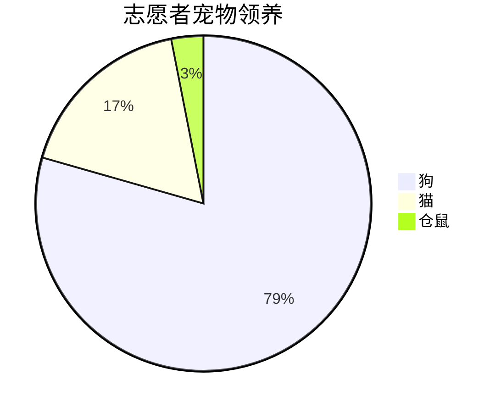

1- [前言](https://blog.csdn.net/qq_40818172/article/details/126260661#_4)
- [一、Markdown是什么](https://blog.csdn.net/qq_40818172/article/details/126260661#Markdown_11)
- [二、Markdown优点](https://blog.csdn.net/qq_40818172/article/details/126260661#Markdown_26)
- [三、Markdown的基本语法](https://blog.csdn.net/qq_40818172/article/details/126260661#Markdown_37)
- - [3.1 标题](https://blog.csdn.net/qq_40818172/article/details/126260661#31__38)
    - [3.2 字体](https://blog.csdn.net/qq_40818172/article/details/126260661#32__55)
    - [3.3 换行](https://blog.csdn.net/qq_40818172/article/details/126260661#33__70)
    - [3.4 引用](https://blog.csdn.net/qq_40818172/article/details/126260661#34__75)
    - [3.5 链接](https://blog.csdn.net/qq_40818172/article/details/126260661#35__96)
    - [3.6 图片](https://blog.csdn.net/qq_40818172/article/details/126260661#36__111)
    - [3.7 列表](https://blog.csdn.net/qq_40818172/article/details/126260661#37__135)
    - [3.8 分割线](https://blog.csdn.net/qq_40818172/article/details/126260661#38__180)
    - [3.9 删除线](https://blog.csdn.net/qq_40818172/article/details/126260661#39__200)
    - [3.10 下划线](https://blog.csdn.net/qq_40818172/article/details/126260661#310__209)
    - [3.11 代码块](https://blog.csdn.net/qq_40818172/article/details/126260661#311__218)
    - [3.12 表格](https://blog.csdn.net/qq_40818172/article/details/126260661#312__259)
    - [3.13 脚注](https://blog.csdn.net/qq_40818172/article/details/126260661#313__281)
    - [3.14 特殊符号](https://blog.csdn.net/qq_40818172/article/details/126260661#314__296)
- [四、Markdown的高级用法](https://blog.csdn.net/qq_40818172/article/details/126260661#Markdown_315)
- - [4.1 个人看法](https://blog.csdn.net/qq_40818172/article/details/126260661#41__316)
    - [4.2 制作待办事项](https://blog.csdn.net/qq_40818172/article/details/126260661#42__318)
    - [4.3 书写公式](https://blog.csdn.net/qq_40818172/article/details/126260661#43__335)
    - [4.4 绘制流程图](https://blog.csdn.net/qq_40818172/article/details/126260661#44__345)
    - [4.5 绘制序列图](https://blog.csdn.net/qq_40818172/article/details/126260661#45__361)
    - [4.6 绘制甘特图](https://blog.csdn.net/qq_40818172/article/details/126260661#46__372)
    - [4.7 Html](https://blog.csdn.net/qq_40818172/article/details/126260661#47_Html_397)
- [五、Markdown工具](https://blog.csdn.net/qq_40818172/article/details/126260661#Markdown_442)
- [六、总结](https://blog.csdn.net/qq_40818172/article/details/126260661#_448)

---

## 前言

大家好，我是卷不动的小白，如名我可能和大部分人一样是个什么都要学习的小白，当自己潜下心来要记笔记写博客的时候接触到了[Markdown语法](https://so.csdn.net/so/search?q=Markdown%E8%AF%AD%E6%B3%95&spm=1001.2101.3001.7020)。Markdown 是一种轻量级标记语言，通俗的说你记笔记写博客的时候不用管排版如何，只要将自己的内容写上去，Markdown语法就可以给你搞定一切。

---

## 一、Markdown是什么


`Markdown` 是一种[轻量级](https://so.csdn.net/so/search?q=%E8%BD%BB%E9%87%8F%E7%BA%A7&spm=1001.2101.3001.7020)标记语言，创始人为约翰·格鲁伯（John Gruber）。  
`Markdown` 允许人们使用易读易写的纯文本格式编写文档，然后转换成有效的HTML文档。  
`Markdown` 编写的文档可以导出 HTML 、Word、图像、PDF、Epub 等多种格式的文档。  
`Markdown` 编写的文档后缀为 .md, .markdown。  
我个人认为`Markdown`是现在现在是互联网上最流行的写作语言！！！许多网站平台的文章、博客、论文都是基于它写的！！！

> 例如：  
> 国外的GitHub、Reddit、Diaspora、Stack Exchange、OpenStreetMap 、SourceForge等；  
> 国内的CSDN、简书、掘金、博客园、知乎等。

推荐一款 Markdown [编辑器](https://so.csdn.net/so/search?q=%E7%BC%96%E8%BE%91%E5%99%A8&spm=1001.2101.3001.7020)**Typora**（下载链接我放到文末）。这款软件足够轻量级，同时功能做到了尽可能的简单。至于Web编辑器必然是最好的CSDN哈哈哈。

---

## 二、Markdown优点

好多人看到Markdown的标签是【轻量级】【标记】【语言】就直接放弃，想着自己学习了非常多的语言，为了记个笔记写个博客还要再学习一门语言吗？实则不然，Markdown的语言非常非常简单，如果想学，10分钟你完全可以学完90%的常用的语法，而且你从此摆脱排版的折磨，属实是强迫症党的福利了。它的优点不仅限于此：

- 纯文本编辑，只要是支持Markdown编辑的都能获得同样的结果，摆脱排版苦恼
- 学习成本低，常用的语法很少，简单易学快速上手
- 支持跨平台同步数据
- 支持插入图片、视频等
- 随时修改，不必担心word等工具出现排版错误

废话不多说，进入干货阶段

---

## 三、Markdown的基本语法

### 3.1 标题

使用#号标记，可以表示1-6级标题， 随#的个数递增，一级标题字号最大，六级标题字号最小。  
代码如下：

```xml
# 一级标题
## 二级标题
### 三级标题
#### 四级标题
##### 五级标题 
###### 六级标题
```

效果如下：  


> 注意：
> 
> - 最后一个`#`字符与标题中间留一个空格
> - 标题应该置于行首，如果放入表格中可能无法正确解析

### 3.2 字体

星号与下划线都可以，单是斜体，双是粗体，三是粗斜体

|代码|效果|
|---|---|
|`*这是斜体*`|_这是斜体_|
|`_这是斜体_`|_这是斜体_|
|`**这是粗体**`|**这是粗体**|
|`__这是粗体__`|**这是粗体**|
|`***这是粗斜体***`|_**这是粗斜体**_|
|`___这是粗斜体___`|_**这是粗斜体**_|

> 快捷键：  
> 加粗Ctrl+B  
> 斜体Ctrl+I

### 3.3 换行

Markdown换行的方式有很多种:

- 直接在一句话后敲两个空格
- 两句话之间加一个空行
- 如果你在编辑的时候，想让一行文字在显示的时候换行，就在中间加`<br/>`

### 3.4 引用

Markdown 中引用通过符号 `>` 来实现。`>` 符号后的空格，可有可无。  
在引用的区块内，允许换行存在，换行并不会终止引用的区块。如果要结束引用，需要一行空白行，来结束引用的区块。  
代码：

```shell
>这是一个引用
```

效果

> 这是一个引用  
> 此外，引用还可以嵌套使用：  
> 代码：

```markdown
>这是一个引用：
>>这是一个引用的引用
>>>这是一个引用的引用的引用
```

效果：

> 这是一个引用：
> 
> > 这是一个引用的引用
> > 
> > > 这是一个引用的引用的引用
> > 
> > 2
> 
> 2  
> ==规律：引用每按一次空格少一个引用符号==

### 3.5 链接

Markdown中插入链接的使用方式是：  
代码：

```markdown
[链接名称](链接地址)
<链接地址>
即是：
[这是小白的主页](https://blog.csdn.net/qq_40818172?type=lately)
或者
<https://blog.csdn.net/qq_40818172?type=lately>
```

效果：

> [这是小白的主页](https://blog.csdn.net/qq_40818172?type=lately)  
> [https://blog.csdn.net/qq_40818172?type=lately](https://blog.csdn.net/qq_40818172?type=lately)

### 3.6 图片

Markdown中插入图片的使用方式是：  
代码：

```markdown

比如我此文章的图片：

)
```

效果：  
  
也可以`修改位置和图片大小`：  
代码：

```markdown

比如我此文章的图片：

)
```

效果：  
  
`注意：等号前有空格，是x不是*`

> 博主自己经常Ctrl+v粘贴图片更为便捷

```scss

xx
	

上述可以改变图片摆放位置

	

上述不可改变图片拜访位置
```

---

**演示示例**

x  
 =60x60)

```less

```

### 3.7 列表

列表分为有序列表和无序列表

- 无序列表，使用`*`、`+`、`-`，再加一个空格作为列表的标记
- 有序列表，使用数字并加上`.`号，再加一个空格作为列表的标记  
    代码：

```markdown
* 无序列表 1
+ 无序列表 2
- 无序列表 3

1. 有序列表 1
2. 有序列表 2
3. 有序列表 3
```

效果：

> - 无序列表 1
>     
> - 无序列表 2
>     
> - 无序列表 3
>     
> - 有序列表 1
>     
> - 有序列表 2
>     
> - 有序列表 3
>     

如果想要控制列表的层级，则需要在列表符号前使用`Tab`  
代码：

```markdown
+ 无序列表 1
+ 无序列表 2
	+ 无序列表 2.1
	+ 无序列表 2.2

1. 有序列表 1
	1.1 有序列表 1.1
2. 有序列表 2
	2.1 有序列表2.1
```

效果：

- 无序列表 1
    
- 无序列表 2
    
    - 无序列表 2.1
    - 无序列表 2.2
- 有序列表 1
    
    1. 有序列表 1.1
- 有序列表 2
    
    1. 有序列表2.1

### 3.8 分割线

Markdown中给出了多种分割线的样式，我们可以使用分割线让文章结构更加的清晰。  
分割线的使用，可以在一行中用三个`-`or`*`来建立一个分割线，但是注意：在分割线的上面空一行！！！

代码：

```markdown
分割线：

---
***
- - -
* * *
```

效果：

> ---
> 
> ---
> 
> ---
> 
> ---
> 
> 注意：写分割线前，要空一行之后写，否则会导致前一行字体放大。

### 3.9 删除线

删除线的的使用，可以在要添加删除线的文字前后添加两个`~`  
代码：

```markdown
~~这是要被删除的文字~~
```

效果：

> ~~这是要被删除的文字~~

### 3.10 下划线

下划线的使用和html中类似，在需要添加下划线的文字首尾添加`<u>文本</u>`  
代码：

```markdown
<u>这行文字已被添加下划线</u>
```

效果：

> 这行文字已被添加下划线

### 3.11 代码块

Markdown中代码块有两种：  
如果在一行内需要引用代码，只需要用反引号`引起来就好了。  
代码：

```markdown
`Hello` World.
```

效果：

> `Hello` World.

如果是在一个块内需要引用代码，则在需要引用的代码块的前一行和后一行使用三个反引号，同时在前一个反引号后写入代码的语言。  
代码：  
  
效果：

```cpp
#include<iostream>
int main(){
   printf("HelloWorld");
}
```

支持以下语言：

```text
bash
c，clojure，cpp，cs，css
dart，dockerfile, diff
erlang
go，gradle，groovy
haskell
java，javascript，json，julia
kotlin
lisp，lua
makefile，markdown，matlab
objectivec
perl，php，python
r，ruby，rust
scala，shell，sql，swift
tex，typescript
verilog，vhdl
xml
yaml
```

### 3.12 表格

表格使用`|`来分割不同的单元格，使用`-`来分隔表头和其他行

- `:-`：将表头及单元格内容左对齐
- `-:`：将表头及单元格内容右对齐
- `:-:`：将表头及单元格内容居中

代码：

```markdown
| 项目        | 价格   |  数量  |
| --------   | -----:  | :----:  |
| 计算机     | \$1600 |   5     |
| 手机        |   \$12   |   12   |
| 管线        |    [asmath:0]1    |  234  |
```

注意：表格的上方必须是空格行  
效果：

| 项目 | 价格 | 数量 |  
| --- | :---- | :-: |  
| 计算机 | $1600 | 5 |  
| 手机 | $12 | 12 |  
| 管线 | $1 | 234 |

### 3.13 脚注

脚注是对文本的备注，我们时长在论文中看到脚注，在Markdown中的使用方法  
代码：

```markdown
使用 Markdown[^1]可以效率的书写文档, 直接转换成 HTML[^2], 你可以使用 Typora[^T] 编辑器进行书写。
[^1]:Markdown是一种纯文本标记语言
[^2]:HyperText Markup Language 超文本标记语言
[^T]:NEW WAY TO READ & WRITE MARKDOWN.
```

使用 Markdown[^1]可以效率的书写文档, 直接转换成 HTML[^2], 你可以使用 Typora[^T] 编辑器进行书写。

[^1]:Markdown是一种纯文本标记语言
[^2]:HyperText Markup Language 超文本标记语言
[^T]:NEW WAY TO READ & WRITE MARKDOWN.


> 注意：脚注自动被搬运到最后面，请到文章末尾查看，并且脚注后方的链接可以直接跳转回到加注的地方。

### 3.14 特殊符号

对于Markdown中的语法符号，前面家反斜线`\`即可以显示符号本身。  
代码：

```markdown
\\
\*
\_
\+
\.
等等
```

效果：

> \  
> *  
> _  
> +  
> .

---

## 四、Markdown的高级用法

### 1. 个人看法

`Markdown` 是非常厉害的，但是我认为它建立的初衷是为了方便大家记笔记写博客，它具有很强大的功能，例如流程图、复杂的公式呈现，虽然看起来很有用，但是我认为这些功能与它创立的初衷是违背的，而且做流程图和复杂的公式是有专门的工具，而且十分便捷。所以个人认为，`Markdown`的一些高级用法了解一下即可，博主也不是很会使用参考了其他资料稍微来整理一下笔记。此处只简要提一下，如果想要了解更多详细的高级用法：[菜鸟教程Markdown高级用法](https://www.runoob.com/markdown/md-advance.html)、[Cmd Markdown 简明语法手册](https://www.zybuluo.com/mdeditor?url=https://www.zybuluo.com/static/editor/md-help.markdown#cmd-markdown-%E9%AB%98%E9%98%B6%E8%AF%AD%E6%B3%95%E6%89%8B%E5%86%8C)

### 2. 书写公式

Markdown支持书写公式，例如书写一个质能守恒公式。  
`$$`表示整行公式  
代码：

```markdown
$$E=mc^2$$
```

效果：

> $$E=mc2$$

### 6. 加强的代码块

支持四十一种编程语言的语法高亮的显示，行号显示。

非代码示例：

```csharp
$ sudo apt-get install vim-gnome
```

Python 示例：

```python
@requires_authorization
def somefunc(param1='', param2=0):
    '''A docstring'''
    if param1 > param2: # interesting
        print 'Greater'
    return (param2 - param1 + 1) or None

class SomeClass:
    pass

>>> message = '''interpreter
... prompt'''
```

JavaScript 示例：

```javascript
/**
* nth element in the fibonacci series.
* @param n >= 0
* @return the nth element, >= 0.
*/
function fib(n) {
  var a = 1, b = 1;
  var tmp;
  while (--n >= 0) {
    tmp = a;
    a += b;
    b = tmp;
  }
  return a;
}

document.write(fib(10));
```

### 7. 流程图

````rust
```flow
st=>start: Start:>https://www.zybuluo.com
io=>inputoutput: verification
op=>operation: Your Operation
cond=>condition: Yes or No?
sub=>subroutine: Your Subroutine
e=>end

st->io->op->cond
cond(yes)->e
cond(no)->sub->io
```
````

```flow
st=>start: Start:>https://www.zybuluo.com
io=>inputoutput: verification
op=>operation: Your Operation
cond=>condition: Yes or No?
sub=>subroutine: Your Subroutine
e=>end

st->io->op->cond
cond(yes)->e
cond(no)->sub->io
```

[流程图语法参考](http://adrai.github.io/flowchart.js/)

### 8. 序列图

````go
```mermaid
Alice->Bob: Hello Bob, how are you?
Note right of Bob: Bob thinks
Bob-->Alice: I am good thanks!
```
````

```m
Alice->Bob: Hello Bob, how are you?
Note right of Bob: Bob thinks
Bob-->Alice: I am good thanks!
```

[序列图语法参考](http://bramp.github.io/js-sequence-diagrams/)

### 9. 甘特图

甘特图内在思想简单。基本是一条线条图，横轴表示时间，纵轴表示活动（项目），线条表示在整个期间上计划和实际的活动完成情况。它直观地表明任务计划在什么时候进行，及实际进展与计划要求的对比。

````less

````


[甘特图语法参考](https://mermaid.js.org/syntax/gantt.html)

### 10. 思维导图

思维导图是一种将信息以层次结构直观地组织起来的图表，显示整体各部分之间的关​​系。它通常围绕一个概念创建，在空白页的中心绘制为图像，并在其中添加相关的想法表示，例如图像、单词和单词的部分。主要思想直接与中心概念相关，其他思想从这些主要思想中分支出来。

````go

````


[思维导图语法参考](https://mermaid.js.org/syntax/mindmap.html)

### 11. 饼图

饼图（或圆形图）是一种圆形统计图形，被分成多个部分来表示数字比例。在饼图中，每个切片的弧长（以及其中心角和面积）与其所代表的数量成正比。虽然它因与切成薄片的饼相似而得名，但它的呈现方式却各不相同。最早的饼图通常归功于威廉·普莱费尔 1801 年的《统计简表》

````bash

````


[饼图语法参考]([https://mermaid.js.org/syntax/pie.html](https://mermaid.js.org/syntax/pie.html)

### 12. [支持的十九种图表](https://www.zybuluo.com/ghosert/note/2560850)

```undefined
流程图
序列图
类图
状态图
实体关系图
用户旅程图
甘特图
饼图
象限图
需求图
Git图
C4图
思维导图
时间线图
桑基图
XY图表
框图
包裹图
架构图
```

  

[全部十九种图表参考](https://www.zybuluo.com/ghosert/note/2560850)

### 13. 表格支持

```undefined
此行必须空行
| | | |
|-|-|-|
此行必须空行
```

| 项目 | 价格 | 数量 |  
| --- | -----: | :-: |  
| 计算机 | [/asmath:0]1600 | 5 |  
| 手机 |12∣12∣∣管线∣12∣12∣∣管线∣1 | 234 |

> 注意：表格上下必须有空行
> 
> ### 14. 定义型列表

名词 1  
: 定义 1（左侧有一个可见的冒号和四个不可见的空格）

代码块 2  
: 这是代码块的定义（左侧有一个可见的冒号和四个不可见的空格）

```undefined
    代码块（左侧有八个不可见的空格）
```

### 15. Html 标签

本站支持在 Markdown 语法中嵌套 Html 标签，譬如，你可以用 Html 写一个纵跨两行的表格：

```php-template
<table>
    <tr>
        <th rowspan="2">值班人员</th>
        <th>星期一</th>
        <th>星期二</th>
        <th>星期三</th>
    </tr>
    <tr>
        <td>李强</td>
        <td>张明</td>
        <td>王平</td>
    </tr>
</table>
```

<table>  
<tr>  
<th rowspan="2">值班人员</th>  
<th>星期一</th>  
<th>星期二</th>  
<th>星期三</th>  
</tr>  
<tr>  
<td>李强</td>  
<td>张明</td>  
<td>王平</td>  
</tr>  
</table>

也可以实现对字体格式的改变

代码：

```html
<font face="楷体" color=#00ffff size=5>改变文字格式</font>
```

效果：

<font face="楷体" color=#00ffff size=5>改变文字格式</font>

> 改变文字格式

### 16. 内嵌图标

本站的图标系统对外开放，在文档中输入

```php-template
<i class="icon-weibo"></i>
```

即显示微博的图标： <i class="icon-weibo icon-2x"></i>

替换 上述 `i 标签` 内的 `icon-weibo` 以显示不同的图标，例如：

```php-template
<i class="icon-renren"></i>
```

即显示人人的图标： <i class="icon-renren icon-2x"></i>

更多的图标和玩法可以参看 [font-awesome](https://fontawesome.com/v3/icons/) 官方网站。

### 17. 待办事宜 Todo 列表

我们可以使用`Markdown`来制作一个待办事项，格式为、`-[]` 表示未完成；`-[x]`表示已完成

使用带有 [ ] 或 [x] （未完成或已完成）项的列表语法撰写一个待办事宜列表，并且支持子列表嵌套以及混用Markdown语法

**示例代码1**

```markdown
    - [ ] **Cmd Markdown 开发**
        - [ ] 改进 Cmd 渲染算法，使用局部渲染技术提高渲染效率
        - [ ] 支持以 PDF 格式导出文稿
        - [x] 新增Todo列表功能 [语法参考](https://github.com/blog/1375-task-lists-in-gfm-issues-pulls-comments)
        - [x] 改进 LaTex 功能
            - [x] 修复 LaTex 公式渲染问题
            - [x] 新增 LaTex 公式编号功能 [语法参考](http://docs.mathjax.org/en/latest/tex.html#tex-eq-numbers)
    - [ ] **七月旅行准备**
        - [ ] 准备邮轮上需要携带的物品
        - [ ] 浏览日本免税店的物品
        - [x] 购买蓝宝石公主号七月一日的船票
```

  

对应显示如下待办事宜 Todo 列表：


- [ ] **Cmd Markdown 开发**
    - [ ] 改进 Cmd 渲染算法，使用局部渲染技术提高渲染效率
    - [ ] 支持以 PDF 格式导出文稿
    - [x] 新增Todo列表功能 [语法参考](https://github.com/blog/1375-task-lists-in-gfm-issues-pulls-comments)
    - [x] 改进 LaTex 功能
        - [x] 修复 LaTex 公式渲染问题
        - [x] 新增 LaTex 公式编号功能 [语法参考](http://docs.mathjax.org/en/latest/tex.html#tex-eq-numbers)
- [ ] **七月旅行准备**
    - [ ] 准备邮轮上需要携带的物品
    - [ ] 浏览日本免税店的物品
    - [x] 购买蓝宝石公主号七月一日的船票

  
  

[footnote]: 这是一个 _注脚_ 的 **文本**。

[footnote2]: 这是另一个 _注脚_ 的 **文本**。

**示例代码2：**

```markdown
- [ ] 支持以 PDF 格式导出文稿
- [ ] 改进 Cmd 渲染算法，使用局部渲染技术提高渲染效率
- [x] 新增 Todo 列表功能
- [x] 修复 LaTex 公式渲染问题
- [x] 新增 LaTex 公式编号功能
```

效果：

> - [ ]  支持以 PDF 格式导出文稿
> - [ ]  改进 Cmd 渲染算法，使用局部渲染技术提高渲染效率
> - [x]  新增 Todo 列表功能
> - [x]  修复 LaTex 公式渲染问题
> - [x]  新增 LaTex 公式编号功能

---

## 五、Markdown工具

- 本地APP：首推 Typora，当然还有其他一些好用的软件，我用的是Typora；
- 国内博客平台：CSDN、简书、掘金、博客园、知乎等。  
    Typora下载链接：[Typora下载](http://www.itmind.net/20343.html)

---

## 六、总结

为什么要写这篇博客，不仅是为了分享我的学习过程，也是为了给自己记个笔记，哪里忘记了，回来再看一眼，也可以很快的回想起来。所以快快把Markdown语法学起来吧，一起加油！！！

---

1. Markdown是一种纯文本标记语言 [↩︎](https://blog.csdn.net/qq_40818172/article/details/126260661#fnref1)
    
2. HyperText Markup Language 超文本标记语言 [↩︎](https://blog.csdn.net/qq_40818172/article/details/126260661#fnref2)