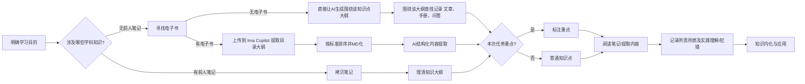

# 2025.6.28 

>**引言**：要以本次 PPT 去激发 STA 队员的团队意识、责任意识，并且检测成员的思考能力、AI能力，同时也是作为提高 PPT 交互性的一个尝试。PPT 设计思路：问题部分就是先把记录到的问题进行场景重现让成员现场模拟情景然后给出我的做法以及原因解释；检测部分就是围绕着我们的 STA 能力标准去出一个现实情景问题现场各个成员去做

>**总结**：问题不是一开始就清晰的，他是在我们不断交互（记录所思、所写）的过程中不断变得清晰的；如果要考虑 PPT 那么一个月一次的问题反省会议需要提前一周进行每天的准备；创建了团队反省模板 **“简述-案例-现象-后果-原因-做法”** 

## 近况部分

>**引言**：由于任务记录表数据过少便不分析了，主要分析那三周的出勤状况。本表的分析利用了 AI 技术，顺带作为 AI 直接数据分析的一个使用案例展现给你们看。


<center><b> 第十三周</b></center>

| 员工姓名 | 周内合规性     | 周末合规性   | 总结        |
| ---- | --------- | ------- | --------- |
| 谢承旭  | ✅（全勤）     | ✅（周六全天） | 全部符合      |
| 程煜博  | ✅（周三至周五）  | ✅（周六全天） | 全部符合      |
| 刘子劢  | ❌（仅周二、周四） | ❌（无）    | 周内、周末均不达标 |
| 王傲然  | ✅（全勤）     | ✅（周六下午） | 全部符合      |
| 刘震涛  | ❌（仅周三）    | ✅（周六下午） | 周内不达标     |
| 韩金鹏  | ❌（无）      | ✅（周六下午） | 周内不达标     |
| 张程   | ❌（无）      | ✅（周六下午） | 周内不达标     |
| 杜周   | ❌（无）      | ✅（周六晚上） | 周内不达标     |
| 蔡一凡  | ❌（无）      | ❌（无）    | 全部不达标     |
| 邢国莹  | ✅（周四）     | ✅（周六下午） | 全部符合      |
| 陈伊曼  | ✅（周一、周三）  | ✅（周六下午） | 全部符合      |

<center><b> 第十四周</b></center>

| 员工姓名 | 周内合规性     | 周末合规性   | 总结        |
| ---- | --------- | ------- | --------- |
| 谢承旭  | ✅（全勤）     | ✅（周六全天） | 全部符合      |
| 程煜博  | ✅（全勤）     | ✅（周六全天） | 全部符合      |
| 刘子劢  | ❌（仅周二、周四） | ❌（无）    | 周内、周末均不达标 |
| 王傲然  | ✅（全勤）     | ✅（周六下午） | 全部符合      |
| 刘震涛  | ❌（仅周三）    | ✅（周六下午） | 周内不达标     |
| 韩金鹏  | ❌（无）      | ❌（无）    | 全部不达标     |
| 张程   | ❌（无）      | ❌（无）    | 全部不达标     |
| 杜周   | ❌（无）      | ❌（无）    | 全部不达标     |
| 蔡一凡  | ❌（无）      | ❌（无）    | 全部不达标     |
| 邢国莹  | ✅（周一、周四）  | ❌（无）    | 周末不达标     |
| 陈伊曼  | ✅（周三）     | ✅（周六下午） | 全部符合      |

<center><b> 第十五周考勤分析</b></center>


| 员工姓名 | 周内合规性          | 周末合规性   | 总计    |
| ---- | -------------- | ------- | ----- |
| 谢承旭  | ✅（周一、周三、周四、周五） | ✅（周六上午） | 全部符合  |
| 程煜博  | ✅（全勤）          | ✅（周六全天） | 全部符合  |
| 刘子劢  | ✅（周一、周二、周三）    | ✅（周六下午） | 全部符合  |
| 王傲然  | ✅（全勤）          | ❌（无）    | 周末不达标 |
| 刘震涛  | ✅（周二、周三）       | ✅（周六下午） | 全部符合  |
| 韩金鹏  | ❌（无）           | ❌（无）    | 全部不达标 |
| 张程   | ❌（无）           | ✅（周日下午） | 周内不达标 |
| 杜周   | ❌（无）           | ✅（周日下午） | 周内不达标 |
| 蔡一凡  | ❌（无）           | ✅（周日下午） | 周内不达标 |
| 邢国莹  | ✅（周四）          | ❌（无）    | 周末不达标 |
| 陈伊曼  | ✅（周一、周二、周三）    | ✅（周六下午） | 全部符合  |

---

#### **核心问题与建议**

##### **1. 高频违规人员**

- **刘子劢、韩金鹏、杜周、蔡一凡** ：
    - **问题** ：连续多周未达到周内或周末考勤要求。
    - **建议** ：
        - 核实是否为兼职或特殊岗位，若非，则需约谈并制定整改计划。
        - 对未达标的周末时段，强制安排补足时间（如调休或加班）。


##### **2. 新规执行漏洞**

- **张程、刘震涛** ：
    - **问题** ：周内出勤分散（如仅周三出勤），难以保证连续性。
    - **建议** ：
        - 规定周内实验时间需固定时段（如每周二下午），避免碎片化安排。
        - 建立实验日志制度，验证实际工作内容。

---

#### **改进方案示例**

1. **考勤模板优化**
    
    - 在表格中增设 **“实验任务备注”** 列，标注是否为集合/组会，便于区分有效实验时间。
    
2. **动态追踪机制**
    
    - 每周五汇总当周考勤，对未达标者发送预警邮件。
    
3. **弹性调整规则**
    - 允许跨周补足时间（如第十三周未达标，可在第十四周加倍完成），但需提前报备。


## 问题部分


### 个人问题

#### 主动性问题

**1. 不换位思考任务派发目的：**

- **案例：**
    - **任务：** 你（作为任务发布者）安排团队成员小王撰写一份关于“AI 助手”用户反馈的报告。
    - **情景 A（未换位思考）：** 你只是简单地告诉小王：“写一份用户反馈报告，下周五之前交给我。” 小王没有询问报告的具体用途和要求，只是按照自己的理解，简单地整理了一些用户评论，提交了一份内容空泛、缺乏分析的报告。
    - **情景 B（换位思考）：** 你在发布任务时，详细地告诉小王：“我们需要一份用户反馈报告，目的是了解用户对‘AI 助手’的满意度和不满意的地方，以便我们改进产品。这份报告需要包含用户评论的整理、分类、分析，以及改进建议。你可以参考之前的用户反馈报告模板。” 小王理解了报告的目的和要求，认真地整理和分析了用户评论，提交了一份内容详实、分析深入的报告，为产品改进提供了有价值的参考。
    - **分析：** 在情景 A 中，小王没有换位思考，只是被动地完成了任务，导致报告质量不高。在情景 B 中，小王通过换位思考，理解了任务的目的和要求，主动地完成了任务，为产品改进做出了贡献。


- **现象：** 成员只是被动接受任务，并没有换位思考任务的发布者是出于何种目的发布任务的。
- **后果：**
    - 任务执行效率低下，可能无法达到预期效果。
    - 成员对任务的理解不够深入，容易出现偏差。
    - 缺乏主动性和创造性，难以提出改进意见。
    - 团队协作效率降低，沟通成本增加。
- **原因：**
    - 缺乏对任务背景和整体目标的了解。
    - 缺乏主动思考和换位思考的意识。
    - 沟通不足，任务发布者没有充分解释任务目的。
    - 团队文化鼓励被动接受，缺乏主动参与的氛围。
- **做法：**
    - **任务发布者：**
        - 在发布任务时，详细解释任务的背景、目的和意义。
        - 说明任务与其他任务的关系，以及对整体目标的贡献。
        - 鼓励成员提问，解答疑问，确保成员充分理解任务。
    - **团队成员：**
        - 主动了解任务的背景和目的，思考任务的意义。
        - 换位思考，理解任务发布者的意图和期望。
        - 积极参与讨论，提出自己的想法和建议。
    - **团队层面：**
        - 建立开放的沟通渠道，鼓励成员分享信息和想法。
        - 营造积极主动的团队文化，鼓励成员参与决策。
        - 定期组织团队会议，讨论项目进展和目标，增强团队凝聚力。


**2. 不曾主动感知问题并解决：**

- **现象：** 成员在遇上一些问题，比如 Obsidian 的同步，明明自己需要，但是不思考、检索方案去解决这个问题。从这个角度上，也就是说没有感知到需求与实际之间的矛盾。
- **后果：**
    - 问题长期存在，影响工作效率和体验。
    - 依赖性强，个人能力无法提升。
    - 小问题积累成大问题，增加解决难度。
    - 团队整体效率降低，资源浪费。
- **原因：**
    - 缺乏对自身需求的敏感度，没有意识到问题的存在。
    - 缺乏主动解决问题的意识和能力。
    - 害怕麻烦，不愿意花费时间和精力去解决问题。
    - 团队缺乏鼓励自主解决问题的文化。
- **做法：**
    - **团队成员：**
        - 提高对自身需求的敏感度，及时发现问题。
        - 主动思考问题的原因和解决方案。
        - 利用搜索引擎、文档、论坛等资源，自主学习和解决问题。
        - 记录解决问题的过程，总结经验教训。
    - **团队层面：**
        - 鼓励成员分享遇到的问题和解决方案。
        - 提供必要的培训和资源，帮助成员提升问题解决能力。
        - 建立奖励机制，鼓励成员自主解决问题。
        - 营造积极主动的团队文化，鼓励成员发现和解决问题。
- **案例：**
    - **问题：** 团队成员小李在使用 Obsidian 记录项目笔记时，遇到了同步问题，导致笔记在不同设备上无法同步。
    - **情景 A（未主动感知和解决）：** 小李只是简单地抱怨：“Obsidian 的同步有问题，我的笔记在手机上看不到。” 他没有尝试查找解决方案，也没有向团队成员求助，只是继续使用不同步的笔记，影响了工作效率。
    - **情景 B（主动感知和解决）：** 小李发现 Obsidian 的同步问题后，意识到这会影响自己的工作效率。他主动搜索 Obsidian 同步问题的解决方案，了解到可能是由于同步设置不正确或者网络问题导致的。他检查了自己的同步设置，确保所有设备都连接到同一个同步服务器，并检查了网络连接。最终，他发现是由于手机上的 Obsidian 没有开启自动同步功能，导致笔记无法同步。他开启了自动同步功能，问题得到了解决。
    - **分析：** 在情景 A 中，小李没有主动感知和解决问题，导致问题长期存在，影响了工作效率。在情景 B 中，小李通过主动感知和解决问题，提高了工作效率，也提升了自己的问题解决能力。


#### 效率性问题

**1. 缺乏项目文档记录：**

- **现象：**
    - 做项目时没有相关的架构设计手册。
    - 没有实现步骤的详细记录。
    - 缺少问题文档的记录。
- **后果：**
    - 后期更新功能时效率低下，难以快速定位和解决问题。
    - 新成员难以快速上手项目，增加学习成本。
    - 知识无法有效沉淀，经验难以复用。
- **原因：**
    - 项目初期缺乏规划，没有意识到文档的重要性。
    - 团队成员没有养成良好的文档记录习惯。
    - 缺乏有效的文档管理工具和流程。
- **做法**
	- **项目启动阶段：**
	    - **制定文档规范：** 明确文档的类型、格式、命名规则等。
	    - **选择文档工具：** 以Obsidian或者Topora作为MD文档写作工具。
	    - **分配文档责任人：** 明确每个文档的负责人，确保文档的及时更新和维护。
	- **项目进行中：**
	    - **编写架构设计手册：** 详细描述项目的整体架构、模块划分、接口定义等。
	    - **记录实现步骤：** 记录每个功能的实现步骤、关键代码、遇到的问题和解决方案。
	    - **创建问题文档：** 记录项目中遇到的问题、解决方案、测试结果等。
	- **项目结束后：**
	    - **整理文档：** 对项目文档进行整理和归档，方便后续查阅和复用。
	    - **知识分享：** 组织团队成员进行知识分享，总结项目经验和教训。


**2. 目标时间不明确：**

- **现象：**
    - 没有为既定目标设定合适的完成时间。
- **后果：**
    - 项目进度难以控制，容易延期。
    - 团队成员缺乏时间压力，工作效率低下。
    - 资源分配不合理，可能导致资源浪费。
- **原因：**
    - 对任务的复杂度和所需时间评估不足。
    - 缺乏有效的时间管理工具和方法。
    - 没有养成按时完成任务的习惯。
- **建议**
	
	- **任务分解：** 将大目标分解为小任务，评估每个任务所需的时间。
	- **时间估算：** 采用 PERT、三点估算法等方法，更准确地估算任务时间。
	- **制定时间表：** 使用甘特图、日历等工具，制定详细的时间表。
	- **跟踪进度：** 定期跟踪任务进度，及时调整时间表。
	- **预留缓冲：** 在时间表中预留一定的缓冲时间，应对突发情况。


**3. 行动目的不明确：**

- **现象：**
    - 行动目的不确定，导致自己行动大方向无法把控。
- **后果：**
    - 工作方向不明确，容易偏离目标。
    - 精力分散，效率低下。
    - 缺乏成就感，影响工作积极性。
- **原因：**
    - 对自身角色和职责定位不清晰。
    - 缺乏对团队目标的整体理解。
    - 没有养成目标导向的工作习惯。
- **建议**
	- **明确目标：** 在开始行动前，明确行动的目的和意义。
	- **分解目标：** 将大目标分解为小目标，逐步实现。
	- **制定计划：** 制定详细的行动计划，明确每个步骤的任务和时间。
	- **定期回顾：** 定期回顾行动进展，确保方向正确。
	- **寻求反馈：** 向他人寻求反馈，及时调整行动方向。


**4. 盲目求助：**

- **现象：**
    - 没有对自己的问题进行初步调查，就盲目问人。
- **后果：**
    - 造成双方效率性低下，浪费时间。
    - 依赖性强，不利于个人能力提升。
    - 问题解决质量不高，可能出现重复提问。
- **原因：**
    - 缺乏独立思考和解决问题的能力。
    - 没有养成自主学习和检索信息的习惯。
    - 害怕出错，不敢尝试。
- **建议**
	- **自主学习：** 遇到问题时，先尝试通过搜索引擎、文档、书籍等途径自主学习。
	- **问题分析：** 对问题进行分析，明确问题的类型、原因和影响。
	- **尝试解决：** 尝试自己解决问题，锻炼解决问题的能力。
	- **记录过程：** 记录解决问题的过程，方便后续复用。
	- **有效提问：** 在提问前，明确问题、已尝试的解决方案和期望的帮助。


**案例：优化项目“AI 助手”的功能更新流程**

**背景：**

- STA 团队正在开发一个名为“AI 助手”的项目，旨在为用户提供智能化的信息检索和问题解答服务。
- 近期，团队需要对“AI 助手”进行一次重要的功能更新，包括优化自然语言处理算法、增加新的知识库和改进用户界面。
- 在之前的项目开发过程中，团队遇到了以下问题：
    - 缺乏项目文档记录，导致后期更新效率低下。
    - 目标时间不明确，项目进度难以控制。
    - 行动目的不明确，团队成员工作方向不清晰。
    - 盲目求助，浪费了大量时间和精力。

**目标：**

- 通过优化项目流程，提高“AI 助手”功能更新的效率和质量。
- 培养团队成员良好的文档记录、时间管理、目标导向和问题解决习惯。

**具体步骤：**

1. **项目启动阶段：**
    
    - **制定文档规范：**
        - 确定文档类型：架构设计文档、API 文档、实现步骤文档、问题记录文档、测试报告等。
        - 确定文档格式：统一使用 Markdown 格式，方便编辑和版本控制。
        - 确定命名规则：采用“项目名称_模块名称_文档类型_版本号”的命名方式。
    - **选择文档工具：**
        - 选择Obsidian作为团队的文档管理工具，方便在线编辑、协作和知识沉淀。
    - **分配文档责任人：**
        - 指定小明负责架构设计文档的编写和维护。
        - 指定小红负责 API 文档的编写和维护。
        - 指定小刚负责实现步骤文档的编写和维护。
        - 指定小丽负责问题记录文档的编写和维护。
    - **召开项目启动会议：**
        - 明确本次功能更新的目标和意义：提升用户体验，扩大用户群体。
        - 分解目标：将功能更新分解为自然语言处理算法优化、知识库扩充和用户界面改进三个子任务。
        - 制定时间表：使用甘特图制定详细的时间表，明确每个子任务的开始和结束时间。
2. **项目进行中：**
    
    - **编写架构设计文档：**
        - 小明详细描述“AI 助手”的整体架构、模块划分、接口定义等。
        - 使用流程图和时序图，更清晰地展示系统的运行流程。
    - **记录实现步骤：**
        - 小刚记录每个功能的实现步骤、关键代码、遇到的问题和解决方案。
        - 使用代码片段和注释，方便其他成员理解和复用。
    - **创建问题文档：**
        - 小丽记录项目中遇到的问题、解决方案、测试结果等。
        - 对问题进行分类和标记，方便后续查找和分析。
    - **定期跟踪进度：**
        - 每周召开项目例会，汇报项目进展、遇到的问题和解决方案。
        - 使用项目管理工具，跟踪任务完成情况，及时调整时间表。
3. **问题解决：**
    
    - **自主学习：**
        - 小红在开发 API 接口时，遇到了跨域访问的问题。
        - 她先通过搜索引擎查找相关资料，学习 CORS 的原理和解决方案。
    - **问题分析：**
        - 她分析了问题的类型、原因和影响，确定是由于服务器端没有设置允许跨域访问的响应头。
    - **尝试解决：**
        - 她尝试在服务器端设置 `Access-Control-Allow-Origin` 响应头，允许跨域访问。
    - **记录过程：**
        - 她记录了解决问题的过程，包括搜索到的资料、分析过程、解决方案和测试结果。
    - **有效提问：**
        - 如果她无法解决问题，她会向团队成员提问，明确问题、已尝试的解决方案和期望的帮助。
4. **项目结束后：**
    
    - **整理文档：**
        - 对项目文档进行整理和归档，方便后续查阅和复用。
    - **知识分享：**
        - 组织团队成员进行知识分享，总结项目经验和教训。
        - 分享解决问题的思路和方法，提高团队成员的技能水平。

**预期效果：**

- 项目文档记录更加完善，方便后续维护和更新。
- 项目进度更加可控，按时完成任务。
- 团队成员工作方向更加明确，效率更高。
- 问题解决能力得到提升，减少盲目求助的情况。


#### 责任性问题

- 【不曾意识到我们的责任】我们这个地方承载着太多人的期望，有很多人希望我们能够成为我们学校打破传统规则的第一支队伍。每天把时间过度花在短视频中、花费在娱乐之中（注意：我指的是过度），这是否合理是需要每一个人去思考的，因为你选择来到了这里并且几次的队伍建设费用都给了，那我认为你还是比较重视这个地方，所以请明确身为 STA 一员的责任。


- **案例：小张的转变**
	
	- **背景：**
	    
	    - 小张是 STA 团队的一员，负责前端开发工作。
	    - STA 团队是学校重点扶持的创新团队，肩负着打破传统、引领技术潮流的期望。
	    - 近期，团队正在开发一个具有重要意义的项目，但项目进展缓慢。
	    - 团队负责人发现，小张经常在工作时间刷短视频、玩游戏，工作效率低下。
	- **情景 A（转变前）：**
	    
	    - 小张认为 STA 团队只是一个普通的学生组织，没有意识到团队所承载的期望和责任。
	    - 他觉得完成自己的任务就可以了，没有必要为团队的整体目标付出更多努力。
	    - 他经常在工作时间刷短视频、玩游戏，认为这是放松和娱乐的方式。
	    - 他对团队的进展漠不关心，很少参与团队讨论和活动。
	    - 最终，由于小张的拖延和懈怠，导致他负责的任务没有按时完成，影响了项目的整体进度。
	- **转折点：**
	    
	    - 团队负责人与小张进行了一次深入的谈话。
	    - 团队负责人向小张介绍了 STA 团队的定位和目标，强调了团队所承载的期望和责任。
	    - 团队负责人分享了团队成员的奋斗故事，激发了小张的责任感和荣誉感。
	    - 团队负责人鼓励小张将个人目标与团队目标相结合，为团队发展贡献力量。
	- **情景 B（转变后）：**
	    
	    - 小张意识到 STA 团队的重要性，开始认真对待自己的工作。
	    - 他主动学习新的技术知识，提高自己的技能水平。
	    - 他合理安排时间，避免过度沉迷于娱乐。
	    - 他积极参与团队讨论和活动，为团队发展献计献策。
	    - 他按时完成了自己的任务，并主动帮助其他成员解决问题。
	    - 最终，小张成为了团队中的骨干力量，为项目的成功做出了重要贡献。
	- **分析：**
	    
	    - 在情景 A 中，小张没有意识到 STA 团队的责任，过度沉迷于娱乐，导致工作效率低下，影响了团队的整体进度。
	    - 通过团队负责人的引导和教育，小张意识到了 STA 团队的重要性，转变了态度，积极投入到工作中，最终成为了团队中的重要力量。
	    - 这个案例说明，团队成员的责任意识对于团队的成功至关重要。团队需要加强责任教育，引导成员将个人目标与团队目标相结合，共同为团队发展努力。
	
- **现象：** 团队成员不曾意识到 STA 团队所承载的期望和责任，过度沉迷于短视频和娱乐。
- **后果：**
    - 团队整体效率低下，难以完成既定目标。
    - 浪费了宝贵的学习和成长机会。
    - 团队凝聚力下降，成员之间缺乏共同目标和责任感。
- **原因：**
    - 对 STA 团队的定位和目标认识不清。
    - 缺乏对自身责任的认知和担当。
    - 自律性较差，容易受到外界诱惑。
    - 团队缺乏有效的激励和约束机制。
- **做法：**
    - **团队层面：**
        - **明确团队使命：** 强调 STA 团队的特殊性和重要性，让成员意识到团队所承载的期望。
        - **树立共同目标：** 制定明确的团队目标，让成员朝着共同的方向努力。
        - **加强责任教育：** 定期组织团队成员学习团队规章制度，明确成员的权利和义务。
        - **建立激励机制：** 对积极履行责任、为团队做出贡献的成员进行奖励。
        - **建立约束机制：** 对不履行责任、影响团队发展的成员进行批评和惩罚。
        - **营造积极氛围：** 鼓励成员分享学习心得和经验，营造积极向上的团队氛围。
    - **团队成员：**
        - **反思自身行为：** 思考自己是否尽到了作为 STA 一员的责任。
        - **明确个人目标：** 将个人目标与团队目标相结合，为团队发展贡献力量。
        - **提高自律性：** 合理安排时间，避免过度沉迷于娱乐。
        - **积极参与团队活动：** 增强团队凝聚力，共同为团队目标努力。
		
	


#### 学习性问题


**1. 不曾主动记录笔记**

*   **案例：**
    *   小周参加了一个关于“深度学习”的线上课程。课程内容丰富，涉及了多种神经网络模型和优化算法。
    *   **情景 A（未记录笔记）：** 小周只是听课，没有做任何笔记。几天后，当他尝试复习课程内容时，发现自己几乎忘记了所有知识点，无法完成作业。
    *   **情景 B（记录笔记）：** 小周在听课的同时，认真记录笔记，包括关键概念、公式、示例代码等。几天后，当他尝试复习课程内容时，通过笔记快速回忆起了所有知识点，顺利完成了作业。
*   **现象：** 团队成员不曾主动记录笔记。
*   **后果：**
    *   知识掌握不牢固，容易遗忘。
    *   学习效率低下，需要花费更多时间复习。
    *   无法有效积累知识，难以形成自己的知识体系。
    *   在实际应用中，难以快速回忆和运用所学知识。
*   **原因：**
    *   认为记录笔记浪费时间，不如直接听课。
    *   缺乏记录笔记的习惯和方法。
    *   认为课程内容不重要，没有记录的必要。
    *   缺乏对知识的长期规划和管理。
*   **做法：**
    *   **强调记录笔记的重要性：** 说明记录笔记可以帮助巩固知识、提高学习效率、积累知识体系。
    *   **提供记录笔记的方法：** 介绍康奈尔笔记法、思维导图等常用的笔记方法。
    *   **鼓励分享笔记：** 鼓励团队成员分享自己的笔记，互相学习和借鉴。
    *   **提供笔记工具：** 推荐使用 Obsidian、Notion 等笔记工具，方便记录和管理笔记。

**2. 不曾主动迁移所学知识**

*   **案例：**
    *   团队需要开发一个图像识别功能。你安排小李学习相关的深度学习算法。
    *   **情景 A（未迁移知识）：** 小李完成了你安排的学习任务，掌握了图像识别的基本原理和常用模型。但是，他只是完成了任务，没有尝试将所学知识应用到实际项目中，也没有尝试改进现有的算法。
    *   **情景 B（迁移知识）：** 小李完成了你安排的学习任务后，主动思考如何将所学知识应用到实际项目中。他尝试使用不同的模型和参数，优化图像识别的准确率和效率。他还主动学习了最新的研究成果，尝试改进现有的算法。
*   **现象：** 除了你设定的任务要求外，团队成员不会尝试做得更完美一些，视完成任务为打卡。
*   **后果：**
    *   学习效果不佳，无法真正掌握所学知识。
    *   缺乏创新能力，难以提出新的想法和解决方案。
    *   工作质量不高，无法满足实际需求。
    *   团队整体竞争力下降。
*   **原因：**
    *   缺乏主动性和责任感。
    *   认为完成任务就可以了，没有必要付出更多努力。
    *   缺乏实践机会，难以将所学知识应用到实际项目中。
    *   团队缺乏鼓励创新和实践的氛围。
*   **做法：**
    *   **提供实践机会：** 安排团队成员参与实际项目，让他们有机会应用所学知识。
    *   **鼓励创新：** 鼓励团队成员提出新的想法和解决方案，并提供支持和帮助。
    *   **建立奖励机制：** 对积极迁移知识、提出创新想法的成员进行奖励。
    *   **营造学习氛围：** 鼓励团队成员互相学习和交流，共同进步。

**3. 不曾主动记录 AI 问答内容**

*   **案例：**
    *   小王在开发一个自然语言处理项目时，遇到了一个技术难题。他向 ChatGPT 提问，得到了一个详细的解答。
    *   **情景 A（未记录 AI 问答）：** 小王只是简单地复制了 ChatGPT 的解答，解决了当前的问题。但是，他没有记录 AI 的解答内容，也没有进行深入思考和总结。几天后，当他再次遇到类似的问题时，又需要重新向 AI 提问。
    *   **情景 B（记录 AI 问答）：** 小王在得到 ChatGPT 的解答后，认真记录了 AI 的解答内容，并进行了深入思考和总结。他将 AI 的解答整理成笔记，并添加了自己的理解和思考。几天后，当他再次遇到类似的问题时，通过查看笔记快速找到了解决方案。
*   **现象：** 团队成员对于 AI 解答的内容，不会去记录，不会去思考，不会去自主体系化。
*   **后果：**
    *   无法有效利用 AI 的知识，重复提问，浪费时间。
    *   缺乏对 AI 解答的深入理解，难以真正掌握知识。
    *   无法将 AI 的知识融入到自己的知识体系中。
    *   降低了学习效率和创新能力。
*   **原因：**
    *   认为 AI 的解答可以直接使用，没有记录的必要。
    *   缺乏对 AI 解答的深入思考和总结。
    *   缺乏记录和整理知识的习惯。
    *   没有意识到 AI 知识的价值。
*   **做法：**
    *   **强调记录 AI 问答的重要性：** 说明记录 AI 问答可以帮助巩固知识、提高学习效率、积累知识体系。
    *   **提供记录 AI 问答的方法：** 建议使用 Obsidian 等笔记工具，方便记录和管理 AI 知识。
    *   **鼓励分享 AI 知识：** 鼓励团队成员分享自己记录的 AI 知识，互相学习和借鉴。
    *   **建立 AI 知识库：** 建立一个团队共享的 AI 知识库，方便成员查找和利用 AI 知识。

**4. 自学没有目标以及计划**
- **案例：**
    - 小赵对人工智能很感兴趣，决定自学相关知识。
    - **情景 A（没有计划和目标）：** 小赵只是随意地在网上搜索一些人工智能相关的文章和视频，没有制定学习计划，也没有明确的学习目标。他今天看一篇关于神经网络的文章，明天看一个关于机器学习的视频，学习内容零散，缺乏系统性。几个月后，他发现自己仍然对人工智能一知半解，无法进行实际应用。
    - **情景 B（有计划和目标）：** 小赵在开始自学之前，制定了一个详细的学习计划，明确了学习目标：三个月内掌握人工智能的基本概念和常用算法，能够独立完成一个简单的机器学习项目。他将学习内容分解为多个模块，并为每个模块设定了学习时间和考核标准。他按照计划，系统地学习了人工智能的各个方面，并完成了多个练习项目。三个月后，他成功地掌握了人工智能的基本知识，并能够独立完成一个简单的机器学习项目。
- **现象：** 团队成员自学没有计划，没有目标。
- **后果：**
    - 学习效率低下，浪费时间和精力。
    - 学习内容零散，缺乏系统性。
    - 难以掌握核心知识，无法进行实际应用。
    - 容易感到迷茫和挫败，失去学习兴趣。
- **原因：**
    - 缺乏对自学重要性的认识。
    - 缺乏制定学习计划和目标的能力。
    - 缺乏自律性和执行力。
    - 缺乏有效的学习方法和资源。
- **做法：**
    - **强调自学的重要性：** 说明自学是提升个人能力和竞争力的重要途径。
    - **提供制定学习计划和目标的方法：** 介绍 SMART 原则等常用的目标设定方法。
    - **推荐学习资源：** 推荐一些优质的在线课程、书籍和学习网站。
    - **鼓励分享学习计划和目标：** 鼓励团队成员分享自己的学习计划和目标，互相监督和鼓励。
    - **定期检查学习进度：** 定期检查团队成员的学习进度，及时提供帮助和指导。


**5. 成员喜欢跳读教程**

- **简述：** 团队成员在学习教程时，倾向于跳读，无法完整理解教程内容。
- **案例：**
	- **任务：** 团队成员小王需要学习一个关于 ROS 机器人操作系统的教程。
	- **情景 A（跳读）：** 小王快速浏览教程，只关注自己感兴趣的部分，忽略了其他重要的知识点。在实际操作时，他遇到了很多问题，无法顺利完成任务。
	- **情景 B（完整阅读）：** 小王认真阅读教程，仔细理解每个步骤和概念。在实际操作时，他能够根据教程的指导，逐步解决问题，最终成功完成任务。
- **现象：** 成员特别喜欢跳读教程，往往出现这个特征的都是属于短视频的重度用户。
- **后果：**
	- 无法完整理解教程内容，导致学习效果不佳。
	- 在实际操作中容易遇到问题，影响工作效率。
	- 知识体系不完整，难以进行深入学习和创新。
- **原因：**
	- 适应了短视频的快节奏内容，缺乏耐心阅读长篇教程。
	- 对教程内容缺乏兴趣，只想快速完成任务。
	- 认为自己已经掌握了部分知识，不需要完整阅读教程。
- **做法：**
	- **强调完整阅读的重要性：** 说明完整阅读教程可以帮助全面理解知识，避免遗漏重要信息。
	- **制定阅读计划：** 建议团队成员制定阅读计划，逐步完成教程的学习。
	- **鼓励提问：** 鼓励团队成员在阅读过程中提出问题，加深理解。
	- **提供阅读技巧：** 介绍 SQ3R 阅读法等常用的阅读技巧，提高阅读效率。

**6. 成员不会补充教程**

- **简述：** 团队成员在执行教程时，遇到教程中没有提及的问题，不会主动思考和解决。
- **案例：**
	- **任务：** 团队成员小李需要按照教程搭建一个 Web 服务器。
	- **情景 A（不补充）：** 小李按照教程一步一步操作，当遇到教程中没有提及的配置问题时，他束手无策，无法继续进行。
	- **情景 B（补充）：** 小李按照教程一步一步操作，当遇到教程中没有提及的配置问题时，他主动查阅资料、搜索解决方案，最终成功解决了问题。
- **现象：** 成员在执行教程中对于教程中没有出现的问题不会记录不会自己解决。
- **后果：**
	- 无法独立解决问题，依赖性强。
	- 学习效果不佳，无法真正掌握知识。
	- 缺乏创新能力，难以提出新的想法和解决方案。
- **原因：**
	- 缺乏独立思考和解决问题的能力。
	- 害怕出错，不敢尝试。
	- 缺乏主动性和责任感。
- **做法：**
	- **鼓励独立思考：** 强调独立思考的重要性，鼓励团队成员在遇到问题时先尝试自己解决。
	- **提供问题解决思路：** 介绍常用的问题解决思路，如查阅文档、搜索资料、向他人请教等。
	- **建立问题记录机制：** 鼓励团队成员记录遇到的问题和解决方案，方便后续参考。
	- **营造积极探索的氛围：** 鼓励团队成员分享问题解决经验，共同进步。
	


**7.电子化自学感觉很模糊**

- 成员按照我之前所讲的项目式学习理论，发现最后做完了但是感觉好像什么都没有学。根本原因就在于没有去做记录。这点


<center><b>我的电子化自学方法</b></center>


【自身原因】我因车祸造成海马体鞘质增生后遗症，记忆能力仅为正常人 $\frac{1}{3}$ ，这也造成了我应试能力体现不出我综合能力的原因。因为本质上应试就是考你 输入-记忆-输出。既然弄明白了本质，就不需要在上面浪费时间了，所以我基于Markdown系统开创了一套自己的自学体系。

【借鉴思想】

- 德谟克利："原子论" 哲学
- 康托尔： "集合论" 哲学
- 弗洛伊德："本我、自我、超我" 认知
- 马斯洛："需求层次" 理论

【科学依据】按照三段论描述 [[高中数学 人教版 笔记]]




<center><b>图：基本步骤流程图</b></center>

- 【步骤】
	
	1.  **A (明确学习目的):** 学习的第一步是明确学习的目的，确保学习方向与目标一致。
	2.  **B (涉及哪些学科知识?):** 确定学习内容涉及的学科知识，为后续的资源查找做准备。
	3.  **B -- 有前人笔记 --> C (拷贝笔记):** 如果有前人的笔记，直接拷贝过来，站在巨人的肩膀上学习。
	4.  **B -- 无前人笔记 --> D (寻找电子书):** 如果没有前人的笔记，寻找相关的电子书资源。
	5.  **D --> F (上传到 Ima Copilot 提取目录大纲):** 将电子书上传到 Ima Copilot，提取目录大纲，提高信息处理效率。
	6.  **F --> G (按标准排序并MD化):** 按照一定的标准对提取的目录大纲进行排序，并将电子书转换为 MD 格式，方便编辑和管理。
	7.  **G --> H (AI结构化内容提取):** 利用 AI 技术对 MD 化的电子书进行结构化内容提取，获取关键信息和知识点。
	8.  **C --> E (理清知识大纲):** 理清知识大纲，将学习内容结构化，便于理解和记忆。
	9.  **I (本次任务重点?):** 确定本次任务的重点，有针对性地学习。
	10. **I -- 是 --> J (标注重点):** 标注本次任务的重点，方便后续复习和应用。
	11. **I -- 否 --> K (普通知识点):** 对于非重点的知识点，进行一般性学习。
	12. **J --> L (阅读笔记/提取内容):** 阅读笔记或提取的内容，获取知识。
	13. **K --> L (阅读笔记/提取内容):** 阅读笔记或提取的内容，获取知识。
	14. **L --> M (记录所思所想及实践理解/犯错):** 记录学习过程中的所思所想，以及实践中的理解和错误，促进知识的内化和应用。
	15. **M --> N (知识内化与应用):** 将所学知识内化，并应用到实际项目中，提高解决问题的能力。


<center><b>我的电子化笔记模板</b></center>

```

- ## 1. 本书回忆

---

- ## 2. 本书重点


---

- ## 3. 本书犯错


- ## 4. 本书思考

- ### 4.1. 问题

---

- ### 4.2. 思想

---

## 1. 顶层一级标题

> **引言**：


### 1.1. 顶层二级标题

> **引言**：

- ## 1. 本节回忆

---

- ## 2. 本节重点


---

- ## 3. 本节犯错

---

- ## 4. 本节思考

- ### 4.1. 问题

- ### 4.2. 思想
---

#### 1.1.1. 顶层三级标题（一般到三级标题即可）

> **引言**：


##### (1) 顶层四级标题

###### 1) 顶层五级标题

####### 1 顶层六级标题

- ## 1.次层一级标题
- ### 1.1. 次层二级标题
- #### 1.1.1. 次层三级标题

- ##### （1）次层四级标题
- ###### 1）次层五级标题
- ####### 1 次层六级标题

- 【定义】

- 【例题】

- 【求解】
	
	1. 
	
	2. 
	
	3. 

- 【种类】
	- 【划分1】
	
		A：
		 - 分话1
		 - 分话2
		B：一句话
	
	- 【划分2】一句话讲完


							空格一行
<center><b>表：XXX</b></center>
							空格一行
|   |
| - |
							空格一行

							空格一行
<center><b>图：XXX</b></center>

文本 `行内代码` 文本
							空格一行
文本 $行内公式$ 文本
							空格一行
$$行间公式$$
							空格一行
纯文本
							空格一行

#### 思考题


#### 练习题

- ##### 判断题

- ##### 选择题

- ##### 填空题

- ##### 简答题

- ##### 计算题

#### 工程题
```

- 【参考案例】
	- [[数学分析 笔记]]
	- [[xlwings]]
	- [[西北工业大学 机械原理 第八版 笔记]]


<center><b>我的知识库分类方法</b></center>

我的知识仓库的分类依据是结合[GBT 13745-2009](https://xkb.pku.edu.cn/docs/2018-10/20220328083301969071.pdf)以及[《教育培训学科》修订版 (ISCED-F)](https://uis.unesco.org/sites/default/files/documents/isced-fields-of-education-training-2013-ch.pdf)双重分类依据进行建立的。而至于仓库中的 5、6、7、8、9条目则是自己根据自己的实际生活需要另外增加的。


Q：总结一下这种学习的优点和缺点？


### 团队问题

#### 任务相关问题

**1. 任务发布格式散乱**

- **案例：**
    - 团队正在进行一个名为“智能家居系统”的项目。
    - **情景 A（任务发布格式散乱）：** 你只是在群里发了一条消息：“小王，你负责编写用户界面；小李，你负责编写数据处理模块。” 没有提供任务的背景、时间、关联和注意事项。小王和小李不清楚自己的任务与其他人的任务有什么关系，也不知道自己的任务对项目的整体目标有什么贡献。
    - **情景 B（任务发布格式规范）：** 你在团队会议上，使用规范的任务发布格式：“任务：编写用户界面；背景：为了提升用户体验，需要设计一个简洁易用的用户界面；时间：下周五之前完成；人员：小王；关联：与小李负责的数据处理模块进行对接；注意：用户界面需要支持多种设备，并考虑到用户的操作习惯。” 小王清楚地了解了任务的背景、时间、关联和注意事项，知道自己的任务对项目的整体目标有什么贡献。
- **现象：** 团队成员不明确自己的任务与其他人的任务的关系；成员不知道其他人在干什么；成员不知道自己任务和实验室阶段性目标的关系。
- **后果：**
    - 任务执行效率低下，容易出现偏差。
    - 团队协作困难，沟通成本增加。
    - 项目整体进度受阻，难以按时完成。
    - 团队成员缺乏对项目的整体理解，责任感降低。
- **原因：**
    - 任务发布者缺乏规范的任务发布流程。
    - 团队成员缺乏主动了解任务信息的意识。
    - 团队沟通渠道不畅通，信息传递不及时。
    - 团队缺乏对项目整体目标的明确认识。
- **做法：**
    - **规范任务发布格式：** 采用 "任务+背景+时间+人员+关联+注意" 的格式发布任务信息。
    - **明确任务关联：** 说明任务与其他任务的关系，以及对项目整体目标的贡献。
    - **畅通沟通渠道：** 建立团队沟通平台，方便成员交流信息和想法。
    - **定期召开团队会议：** 讨论项目进展和目标，增强团队凝聚力。

**2. 任务执行力度较差**

- **案例：**
    - 你安排小张负责编写一个数据分析脚本，并明确了完成时间。
    - **情景 A（任务执行力度较差）：** 小张信誓旦旦地接受了任务，但到了截止日期，他仍然没有完成任务，理由是“遇到了很多困难，没有时间解决”。
    - **情景 B（任务执行力度强）：** 小张信誓旦旦地接受了任务，并制定了详细的执行计划。在执行过程中，他遇到了很多困难，但他积极寻求帮助，并努力克服困难。最终，他按时完成了任务。
- **现象：** 团队成员多次信誓满满接受任务，但是次次没有按时完成。
- **后果：**
    - 项目进度严重滞后，影响整体目标实现。
    - 团队成员之间产生不信任感，影响团队协作。
    - 团队整体效率低下，难以完成高质量的项目。
    - 团队声誉受损，难以获得更多的机会。
- **原因：**
    - 团队成员缺乏责任感和执行力。
    - 任务难度过大，超出成员的能力范围。
    - 缺乏有效的任务跟踪和反馈机制。
    - 团队缺乏对任务执行不力的惩罚措施。
- **做法：**
    - **明确任务难度：** 在分配任务前，评估任务难度，确保成员能够胜任。
    - **制定执行计划：** 鼓励成员制定详细的执行计划，并提供必要的支持和帮助。
    - **建立任务跟踪机制：** 定期跟踪任务进展，及时发现和解决问题。
    - **实行奖惩制度：** 对按时完成任务的成员进行奖励，对未按时完成任务的成员进行惩罚。
    - **强调责任担当：** 强调团队成员的责任感和执行力，鼓励成员勇于承担责任。


#### 队伍认知问题

- 【队员对团队认识不清楚】这个不清楚包括 制度认识不清楚、资源认识不清楚、系统认识不清楚、业务认识不清楚。以及最根本的我们的理念、职责的不清楚

- 理念：学中用、用中学；内驱式学习
- 任务：探寻一种适用于我们本校学生的全新人才培养模式，解决我们学校当前大部分同学关于“学不能用”的问题。
- 职责：
	- **服务学校**：通过开展 STA 业务 为校友提供便利——通过论坛为校友提供讨论平台；通过 3D 打印助力学校 Geek 发展；通过零件售卖解决买零件等快递问题；通过工位租借为同学前提条件
	- **开创先列**：我们要达成我们学校开天辟地的第一次，这是一项艰巨的任务，必然辛苦，而且更多的是你们可能有不解。如果你们不解，就当作是来这里的责任来考虑就行。


![[1. STA 设计.canvas|STA 设计]]


#### 队伍合作问题

- 【成员之间发信息已读不回】


- 【成员之间交流任务信息贫乏】


- 【成员未意识到合作开发能力要比个人能力更重要】

## 检测部分

### 个人能力

#### 教程复现


#### 文章写作

<center><b>表：完成评分表（0-1分）</b></center>

| 程煜博 | 刘子劢 | 刘震涛 | 张程  | 杜周  | 蔡一凡 | 韩金鹏 | 陈伊曼 |
| --- | --- | --- | --- | --- | --- | --- | --- |
|     |     |     |     |     |     |     |     |


>**PS**：我猜到你们不会写，因为你们基本上不曾写作过，根本上来讲进行创新能力最重要体现的知识产出行为你们认为没有必要做。那么结论很明显，我做了，所以我才能设计出类似前面那样的系统，因为写作的过程就是与自己内心对话、知识综合利用的过程。

Q：为什么我要检测这一个能力？


Q： “知识产出” 的意义？


#### AI 运用

Mission1：在办公任务方，把下述图片迅速转成为表格输出


Mission2：在代码任务方面，迅速设计一个给队员吐槽的弹幕系统架构

Mission3：在硬件任务方面，迅速给我做一版本STA 脸部扫描打卡系统的任务架构

Mission4：针对以上成员出现的问题进行问题收集


### 团队能力


## 暑假规划


### 第一阶段：基础建设

- 【目的】完成 STA 设计中的架构规划，打造由 NEPU 本科生自己完全设计和建设的第一个 系统完备、资源完备、规章完备、服务完备的实验室。为后续的高效项目、研究奠定基础。

### 第二阶段：基本写作

- 【目的】围绕着我们实验室的运行维护为目的写下维护文档、基本学习手册，为后续实验室换届能够保持正常运行以及新人入门学习提供编写素材。

### 第三阶段：正常运行(不讲)

#### 新人招新

#### 新人培训

#### 寻找问题

#### 提出问题

#### 解决问题

## 结尾部分

### 成员陈述


### 个人结语

当今这个社会，浮夸、浮躁之风弥胜，有人用擦边、灰色话题引起的流量迅速敛财，旁人见之，趋之若附。物质主义之上，科学技术沦为享乐主义的嫁妆，说实话，我很心痛，回首我总能看到“她”在角落默默哭泣，无人来安慰。

坦诚地说，即便你们觉得很装，我可以无愧于我的心说，我的行动不是为了以后那可能的高薪工作，也不是为了所谓的衣食无忧，我只为我的信念而行动。这也是我为什么对这个地方在没有外界激励的情况下仍然如此上心的原因。

对于我，确实是要以团队的、学校的、全国的乃至全人类的理想而去做斗争。倘若有人说宿命论如《雾都物语》描述那般早已决定你的人生轨迹，那我要回答这过是《命运石之门》理论那千万平行线中的一条，通过以《石纪元》那百分之一百亿的努力，就能够跨越这1%的世界命运变动率，打破那固定的命运线。

愿中国青年都摆脱冷气，只是向上走，不必听自暴自弃者流的话。 能做事的做事，能发声的发声。 有一分热，发一分光，就令萤火一般，也可以在黑暗里发一点光，不必等候炬火。 此后如竟没有炬火：我便是唯一的光——鲁迅

所以，能理解也好不理解也罢，将我部署的工作以负责的态度去完成，而且最清楚这个地方究竟能否锻炼自身能力的也是你们身在这里的各位。

STA ，无限进步
# 2025.6.


